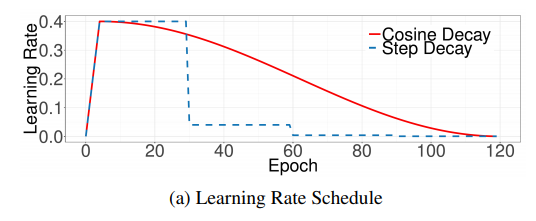
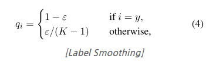
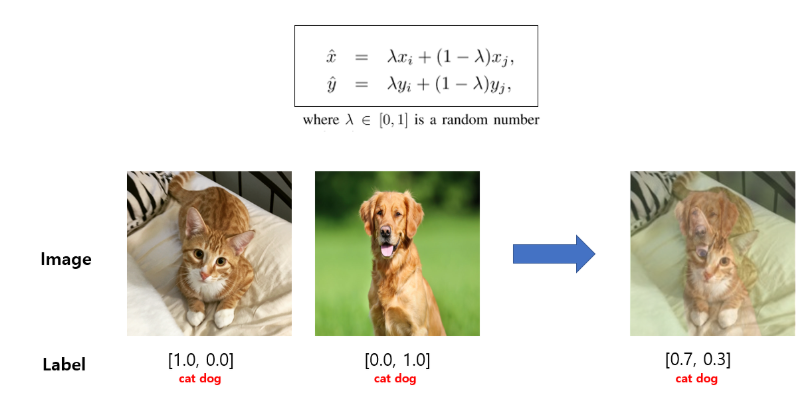
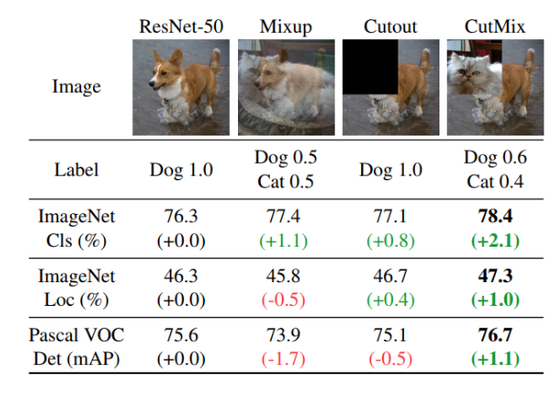
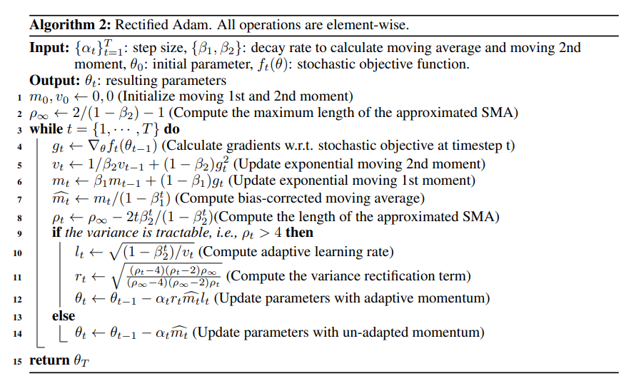
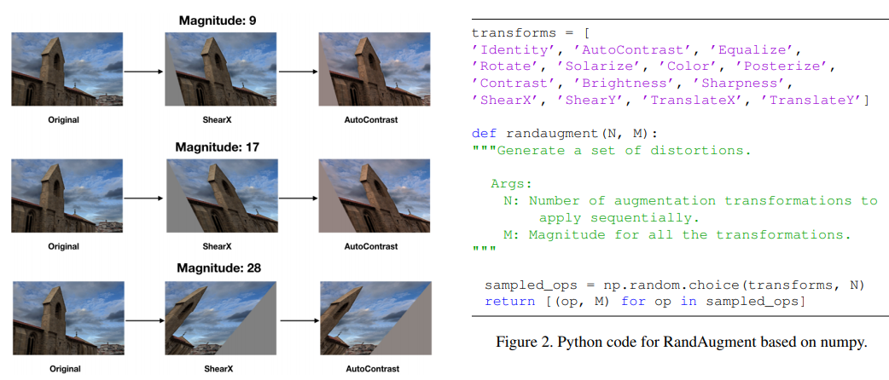
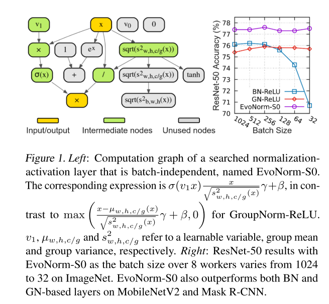
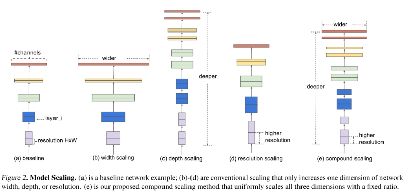
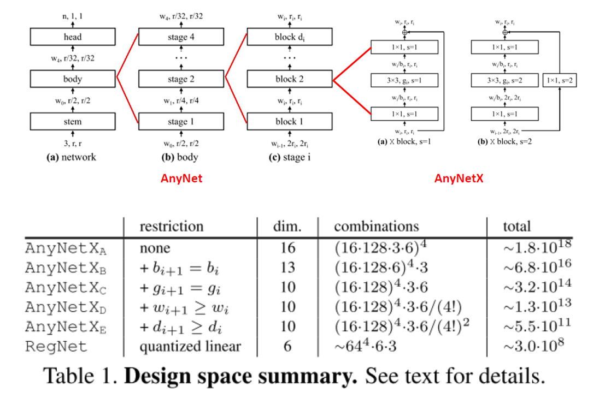
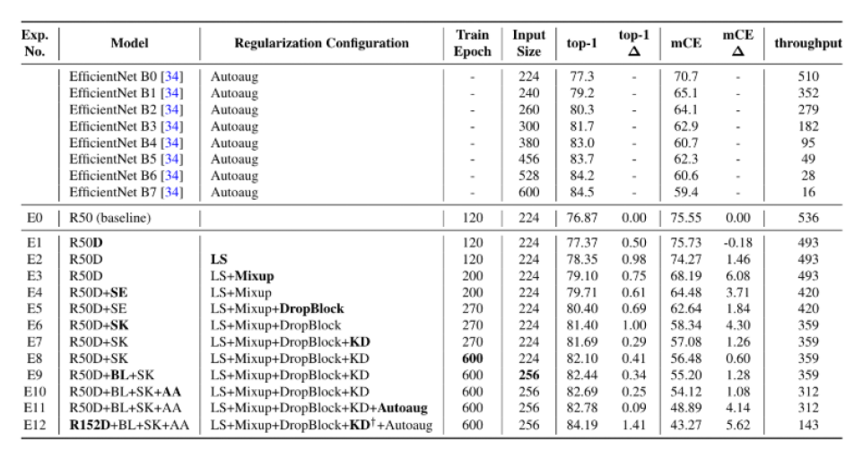

<p align="center">
  
</p>

# carrier-of-tricks-for-classification-pytorch
carrier of tricks for image classification tutorials using pytorch. Based on ["Bag of Tricks for Image Classification with Convolutional Neural Networks", 2019 CVPR Paper](http://openaccess.thecvf.com/content_CVPR_2019/papers/He_Bag_of_Tricks_for_Image_Classification_with_Convolutional_Neural_Networks_CVPR_2019_paper.pdf), implement classification codebase using custom dataset.

- author: hoya012  
- last update: 2020.07.16
- [supplementary materials (blog post written in Korean)](https://hoya012.github.io/blog/Bag-of-Tricks-for-Image-Classification-with-Convolutional-Neural-Networks-Review/)

## 0. Experimental Setup (I used 1 GTX 1080 Ti GPU!)
### 0-1. Prepare Library

```python
pip install -r requirements.txt
```

### 0-2. Download dataset (Kaggle Intel Image Classification)

- [Intel Image Classification](https://www.kaggle.com/puneet6060/intel-image-classification/)

This Data contains around 25k images of size 150x150 distributed under 6 categories.
{'buildings' -> 0,
'forest' -> 1,
'glacier' -> 2,
'mountain' -> 3,
'sea' -> 4,
'street' -> 5 }

### 0-3. Download ImageNet-Pretrained Weights (EfficientNet, RegNet)
- [facebook_research_pycls](https://github.com/facebookresearch/pycls/blob/master/MODEL_ZOO.md)
- download **RegNetY-1.6GF** and **EfficientNet-B2** weights

### 1. Baseline Training Setting
- ImageNet Pretrained ResNet-50 from torchvision.models
- 1080 Ti 1 GPU / Batch Size 64 / Epochs 120 / Initial Learning Rate 0.1
- Training Augmentation: Resize((256, 256)), RandomHorizontalFlip()
- SGD + Momentum(0.9) + learning rate step decay (x0.1 at 30, 60, 90 epoch)

```python
python main.py --checkpoint_name baseline;
```

#### 1-1. Simple Trials
- Random Initialized ResNet-50 (from scratch)

```python
python main.py --checkpoint_name baseline_scratch --pretrained 0;
```

- Adam Optimizer with small learning rate(1e-4 is best!)

```python
python main.py --checkpoint_name baseline_Adam --optimizer ADAM --learning_rate 0.0001
```

### 2. Bag of Tricks from Original Papers
Before start, i didn't try **No bias decay**, **Low-precision Training**, **ResNet Model Tweaks**, **Knowledge Distillation**. 

#### 2-1. Learning Rate Warmup 
- first 5 epochs to warmup

```python
python main.py --checkpoint_name baseline_warmup --decay_type step_warmup;
python main.py --checkpoint_name baseline_Adam_warmup --optimizer ADAM --learning_rate 0.0001 --decay_type step_warmup;
```

#### 2-2. Zero gamma in Batch Normalization
- zero-initialize the last BN in each residual branch

```python
python main.py --checkpoint_name baseline_zerogamma --zero_gamma ;
python main.py --checkpoint_name baseline_warmup_zerogamma --decay_type step_warmup --zero_gamma;
```

#### 2-3. Cosine Learning Rate Annealing


```python
python main.py --checkpoint_name baseline_Adam_warmup_cosine --optimizer ADAM --learning_rate 0.0001 --decay_type cosine_warmup;
```

#### 2-4. Label Smoothing

- In paper, use smoothing coefficient as 0.1. I will use same value.
- The number of classes in imagenet (1000) is different from the number of classes in our dataset (6), but i didn't tune them.

```python
python main.py --checkpoint_name baseline_Adam_warmup_cosine_labelsmooth --optimizer ADAM --learning_rate 0.0001 --decay_type cosine_warmup --label_smooth 0.1;
python main.py --checkpoint_name baseline_Adam_warmup_labelsmooth --optimizer ADAM --learning_rate 0.0001 --decay_type step_warmup --label_smooth 0.1;
```

#### 2-5. MixUp Augmentation
- [MixUp paper link](https://arxiv.org/pdf/1710.09412.pdf)

- lambda is a random number drawn from Beta(alpha, alpha) distribution.
- I will use alpha=0.2 like paper.

```python
python main.py --checkpoint_name baseline_Adam_warmup_mixup --optimizer ADAM --learning_rate 0.0001 --decay_type step_warmup --mixup 0.2;
python main.py --checkpoint_name baseline_Adam_warmup_cosine_mixup --optimizer ADAM --learning_rate 0.0001 --decay_type cosine_warmup --mixup 0.2;
python main.py --checkpoint_name baseline_Adam_warmup_labelsmooth_mixup --optimizer ADAM --learning_rate 0.0001 --decay_type step_warmup --label_smooth 0.1 --mixup 0.2;
python main.py --checkpoint_name baseline_Adam_warmup_cosine_labelsmooth_mixup --optimizer ADAM --learning_rate 0.0001 --decay_type cosine_warmup --label_smooth 0.1 --mixup 0.2;
```

### 3. Additional Tricks from hoya012's survey note
#### 3-1. CutMix Augmentation
- [CutMix paper link](https://arxiv.org/pdf/1905.04899.pdf)

- I will use same hyper-parameter (cutmix alpha=1.0, cutmix prob=1.0) with ImageNet-Experimental Setting

```python
python main.py --checkpoint_name baseline_Adam_warmup_cosine_cutmix --optimizer ADAM --learning_rate 0.0001 --decay_type cosine_warmup --cutmix_alpha 1.0 --cutmix_prob 1.0;
```

#### 3-2. RAdam Optimizer
- [RAdam Optimizer paper link](https://arxiv.org/pdf/1908.03265.pdf)


```python
python main.py --checkpoint_name baseline_RAdam_warmup_cosine_labelsmooth --optimizer RADAM --learning_rate 0.0001 --decay_type cosine_warmup --label_smooth 0.1;
python main.py --checkpoint_name baseline_RAdam_warmup_cosine_cutmix --optimizer RADAM --learning_rate 0.0001 --decay_type cosine_warmup --cutmix_alpha 1.0 --cutmix_prob 1.0;
```

#### 3-3. RandAugment
- [RandAugment paper link](https://arxiv.org/pdf/1909.13719.pdf)
- I will use N=3, M=15.



```python
python main.py --checkpoint_name baseline_Adam_warmup_cosine_labelsmooth_randaug --optimizer ADAM --learning_rate 0.0001 --decay_type cosine_warmup --label_smooth 0.1 --randaugment;
```

#### 3-4. EvoNorm
- [EvoNorm paper link](https://arxiv.org/pdf/2004.02967.pdf)
- [EvoNorm paper review post(Korean Only)](https://hoya012.github.io/blog/evonorm/)

```python
python main.py --checkpoint_name baseline_Adam_warmup_cosine_labelsmmoth_evonorm --optimizer ADAM --learning_rate 0.0001 --decay_type cosine_warmup --label_smooth 0.1 --norm evonorm;
```



#### 3-5. Other Architecture (EfficientNet, RegNet)
- [EfficientNet paper link](https://arxiv.org/pdf/1905.11946.pdf)
- [EfficientNet paper review post(Korean Only)](https://hoya012.github.io/blog/EfficientNet-review/)
- [RegNet paper link](https://arxiv.org/pdf/2003.13678.pdf)




- I will use EfficientNet-B2 which has similar acts with ResNet-50
    - But, because of GPU Memory, i will use small batch size (48)...
- I will use RegNetY-1.6GF which has similar FLOPS and acts with ResNet-50

```python
python main.py --checkpoint_name efficientnet_Adam_warmup_cosine_labelsmooth --model EfficientNet --optimizer ADAM --learning_rate 0.0001 --decay_type cosine_warmup --label_smooth 0.1;
python main.py --checkpoint_name efficientnet_Adam_warmup_cosine_labelsmooth_mixup --model EfficientNet --optimizer ADAM --learning_rate 0.0001 --decay_type cosine_warmup --label_smooth 0.1 --mixup 0.2;
python main.py --checkpoint_name efficientnet_Adam_warmup_cosine_cutmix --model EfficientNet --optimizer ADAM --learning_rate 0.0001 --decay_type cosine_warmup --cutmix_alpha 1.0 --cutmix_prob 1.0;
python main.py --checkpoint_name efficientnet_RAdam_warmup_cosine_labelsmooth --model EfficientNet --optimizer RADAM --learning_rate 0.0001 --decay_type cosine_warmup --label_smooth 0.1;
python main.py --checkpoint_name efficientnet_RAdam_warmup_cosine_cutmix --model EfficientNet --optimizer RADAM --learning_rate 0.0001 --decay_type cosine_warmup --cutmix_alpha 1.0 --cutmix_prob 1.0;
```

```python
python main.py --checkpoint_name regnet_Adam_warmup_cosine_labelsmooth --model RegNet --optimizer ADAM --learning_rate 0.0001 --decay_type cosine_warmup --label_smooth 0.1;
python main.py --checkpoint_name regnet_Adam_warmup_cosine_labelsmooth_mixup --model RegNet --optimizer ADAM --learning_rate 0.0001 --decay_type cosine_warmup --label_smooth 0.1 --mixup 0.2;
python main.py --checkpoint_name regnet_Adam_warmup_cosine_cutmix --model RegNet --optimizer ADAM --learning_rate 0.0001 --decay_type cosine_warmup --cutmix_alpha 1.0 --cutmix_prob 1.0;
python main.py --checkpoint_name regnet_RAdam_warmup_cosine_labelsmooth --model RegNet --optimizer RADAM --learning_rate 0.0001 --decay_type cosine_warmup --label_smooth 0.1;
python main.py --checkpoint_name regnet_RAdam_warmup_cosine_cutmix --model RegNet --optimizer RADAM --learning_rate 0.0001 --decay_type cosine_warmup --cutmix_alpha 1.0 --cutmix_prob 1.0;
```

### 4. Performance Table
- B : Baseline
- A : Adam Optimizer
- W : Warm up 
- C : Cosine Annealing
- S : Label Smoothing
- M : MixUp Augmentation

- CM: CutMix Augmentation
- R : RAdam Optimizer
- RA : RandAugment
- E : EvoNorm 

- EN : EfficientNet
- RN : RegNet

|   Algorithm  | Validation Accuracy | Test Accuracy |
|:------------:|:-------------------:|:-------------:|
|B from scratch|        86.68        |      86.10    |
|       B      |        86.14        |      87.93    |
|     B + A    |        93.34        |      93.90    |
|   B + A + W  |        93.77        |      94.17    |
| B + A + W + C|        93.66        |      93.67    |
| B + A + W + S|        93.94        |      93.77    |
|B + A + W + C + S|     93.80        |      93.63    |
| B + A + W + M|        94.09        |      94.20    |
|B + A + W + S + M|     93.69        |      94.40    |
|B + A + W + C + S + M| 93.77        |      93.77    |
|:------------:|:-------------------:|:-------------:|
|  BAWC + CM   |        94.44        |      93.97    |
|  BWCS + R    |        93.27        |      93.73    |
|  BAWCS + RA  |        93.94        |      93.80    |
|  BAWCS + E   |        93.55        |      93.70    |
| BWC + CM + R |        94.23        |      93.90    |
|:------------:|:-------------------:|:-------------:|
|  EN + AWCSM  |        93.48        |      94.07    |
|EN + AWC + CM |        94.19        |      94.17    |
|EN + WCS + R  |        93.91        |      94.30    |
|EN + WC + CM + R|      93.98        |      94.27    |
|:------------:|:-------------------:|:-------------:|
|  RN + AWCSM  |        94.30        |      94.63    |
|RN + AWC + CM |        93.91        |      94.97    |
|RN + WCS + R  |        93.91        |      94.20    |
|RN + WC + CM + R|      94.48        |      94.57    |

- Tip: I recommend long training epoch if you use many regularization techniques (Label Smoothing, MixUp, RandAugment, CutMix, etc). Remember that i use just **120** epoch. 
    - reference: ["Compounding the Performance Improvements of Assembled Techniques in a Convolutional Neural Network", 2020 arXiv](https://arxiv.org/pdf/2001.06268.pdf)



### 5. How to run all of experiments?
- see [`gpu_history.sh`](https://github.com/hoya012/carrier-of-tricks-for-classification-pytorch/blob/master/gpu_history.sh)

### 6. Code Reference
- Gradual Warmup Scheduler: https://github.com/ildoonet/pytorch-gradual-warmup-lr
- Label Smoothing: https://github.com/NVIDIA/DeepLearningExamples/blob/master/PyTorch/Classification/ConvNets/image_classification/smoothing.py
- MixUp Augmentation: https://github.com/NVIDIA/DeepLearningExamples/blob/master/PyTorch/Classification/ConvNets/image_classification/mixup.py
- CutMix Augmentation:https://github.com/clovaai/CutMix-PyTorch
- RAdam Optimizer: https://github.com/LiyuanLucasLiu/RAdam
- RandAugment: https://github.com/ildoonet/pytorch-randaugment
- EvoNorm: https://github.com/digantamisra98/EvoNorm
- ImageNet-Pretrained EfficientNet, RegNet: https://github.com/facebookresearch/pycls
